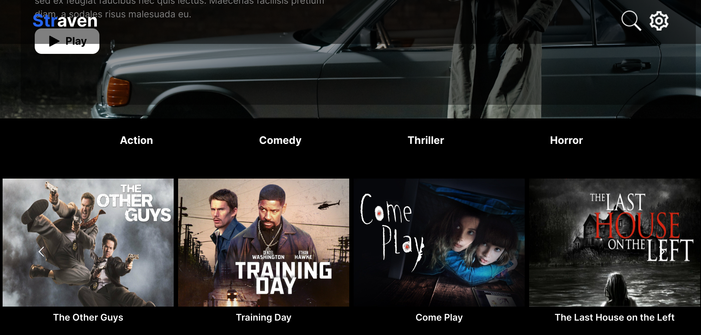

## Overview
Straven is a modern streaming platform that allows users to browse, and stream a vast selection of movies. With a user-friendly, responsive, and visually engaging interface, Straven aims to provide an immersive entertainment experience.

## Technologies
#### Straven is built using the following technologies:

* **Tailwind CSS**:  
A utility-first CSS framework.

* **React JS**:  
A client side JavaScript library for building user interfaces.

* **TypeScript**:  
A statically typed superset of JavaScript that helps catch errors at compile time.

* **MongoDb**:  
A NoSQL database management system that stores data in a document-based format.

* **Express JS**:  
A minimal Node js framework for building RESTful APIs.

* **Node JS**:  
A cross-platform JavaScript runtime environment.

## Features
* **Extensive Content Library**:  
Access a vast collection of movies spanning various genres.

* **Filters**:  
Filter functionality for movie genres.

* **High-Quality Streaming**:  
Stream content in HD.

## Getting Started
#### To get started with Straven locally, follow these steps:

* Clone the repository to your local machine
* Navigate to the project directory
* Run `npm install` to install the necessary dependencies
* Open 2 terminals to run both the client and the server concurrently
* Cd into the client directory in one of the terminals and run `npm run dev` to start the client
* Cd into the server directory in the other terminal and run `npm start` to start the server
  * Note: you will need your own database, and dotenv files for the client **"VITE_API_URL"**, and the server **"DB_URI"**(MongoDB),
    and **"JWT_SECRET"**
